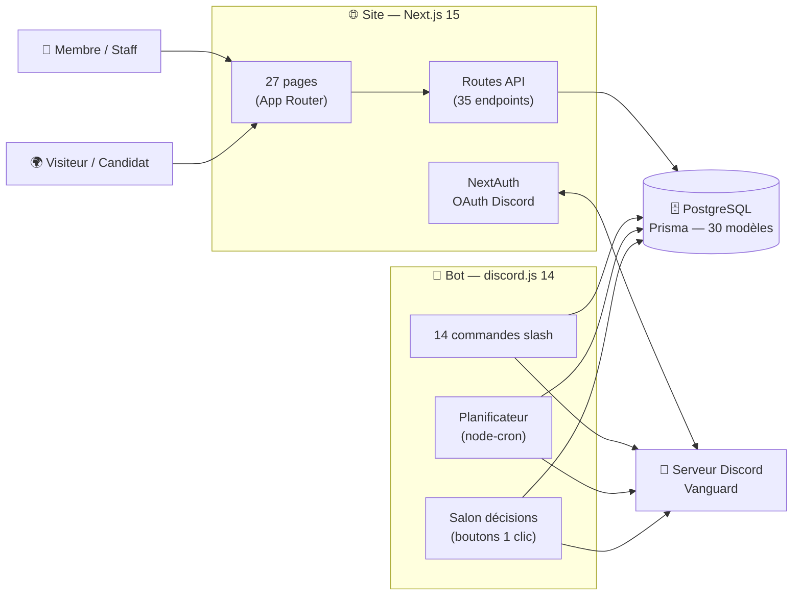
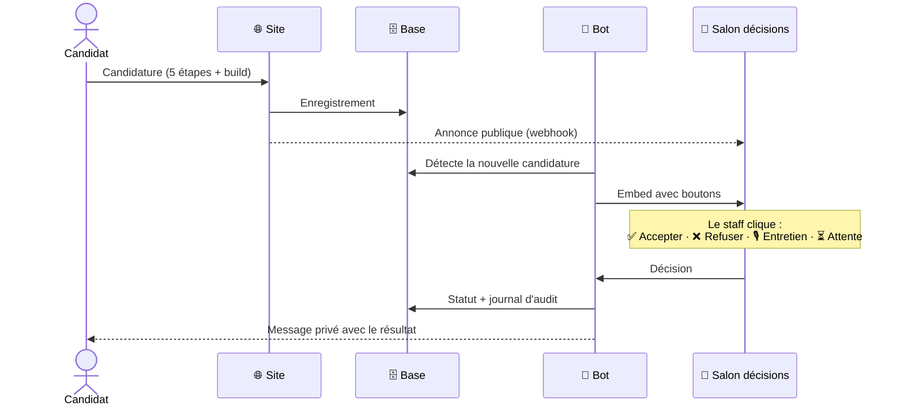
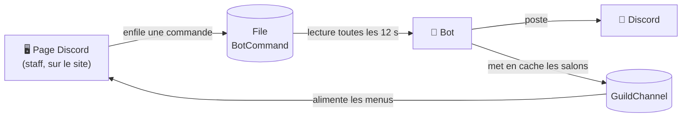

<div align="center">

# 🦉 Vanguard Control Center

**La plateforme tout-en-un de la guilde Vanguard** — serveur privé **AirFlyff**

Un site web et un bot Discord qui partagent la même base de données :
ce qui se passe sur le site se retrouve sur Discord, et inversement.


</div>

---

## 🧭 Vue d'ensemble



- **Connexion Discord** (OAuth) : le rôle Discord du membre détermine ses accès sur le site — vérifié **côté serveur** à 3 niveaux (middleware, layouts, API).
- **Une seule base** : le site écrit, le bot lit (et inversement). Aucun doublon de données.
- **Tout en français**, pensé pour la guilde.

---

## ✨ Le site

### 🌍 Public
| Page | Rôle |
|---|---|
| **Histoire** | Vitrine de la guilde : présentation, objectifs, fonctionnalités |
| **Candidature** | Recrutement en 5 étapes (profil, spés, stuff via le Builder intégré, quiz, récap) — transmis au staff sur Discord, et le build réalisé est **repris automatiquement sur le compte** du candidat une fois accepté |

### ⚔️ Espace membre
| Page | Rôle |
|---|---|
| **Dashboard** | Vue d'ensemble temps réel : membres, persos, dettes, coffre, candidatures, world boss |
| **AirBuilder** | Créateur de build complet (équipement, perçage, sertissage, runes, sets, fées, familiers…) avec **sauvegarde & publication automatiques**, versions archivées, multi-persos et multi-stuffs (DPS / Tank / Hybride) |
| **Chambres Secrètes** | Compositions d'équipe **partagées** : plusieurs candidats par poste, sélection ★ par le staff, **builds de référence consultables par poste** (édités par le rang Vanguard), postes renommables |
| **Banque** | Parcourir le coffre, panier, demandes d'achat (−20 %) ou de dette, suivi des remboursements |
| **Personnages** | Ses persos (classe, prestige, niveau) et profils de stuff |
| **Guides & Prestige** | Guide de progression par palier + **calculateur de prestige** (ressources cumulées entre deux paliers) |
| **Donjons / World Boss** | Wiki des 23 donjons, suivi des runs, présence aux world boss |
| **Échanges / Absences / Paramètres** | Échanges PNJ du serveur, déclaration d'absences, préférences |

### 🛡️ Espace staff
| Page | Rôle |
|---|---|
| **GuildViewer** | Suivi complet des membres : persos, classes, **builds publiés** (avec historique de versions), activité |
| **AirGuild (coffre)** | Coffre de guilde par membre : dépôts, **catégories personnalisables** (création, image, réorganisation par glisser-déposer), fiche détaillée par objet, journal des mouvements, **calculateur de craft** |
| **Plan de farm** | Ce qui manque au coffre pour atteindre les seuils, calculé sur le stock réel |
| **Banque (gestion)** | Traiter les requêtes, fixer les prix, valider les remboursements |
| **Candidatures** | Examiner et décider (accepter / refuser / entretien / attente) |
| **Discord & Événements** | Piloter le bot depuis le site (embeds, giveaways, panneau de classes) et programmer les **événements récurrents du jeu** que le bot annonce tout seul |
| **World Boss (gestion) / Annonces** | Fiches de boss, planification, annonces en embed |

---

## 🤖 Le bot

**14 commandes slash** (`/candidature`, `/dette`, `/dettes`, `/dette-payer`, `/coffre`, `/mesperso`, `/absence`, `/giveaway`, `/embed`, `/boutonrole`, `/rolereaction`, `/panneau-classes`, `/aide`…) et surtout des **automatismes** :

- **Salon décisions** : chaque candidature, demande de dette ou requête banque arrive en embed avec des boutons — le staff décide **en 1 clic**, le membre est prévenu **en message privé**, tout est journalisé.
- **Rappels intelligents** : candidatures en attente, échéances de dettes (MP au débiteur + récap staff), événements du jeu (annonce + rappel X min avant, configurés depuis le site sans redémarrage).
- **Rôles en self-service** : panneau de classes à boutons, bouton-rôles et rôle-réactions (façon MEE6, mais maison).
- **Giveaways** : participation par bouton, tirage et clôture automatiques, reroll.



Le site peut aussi **commander le bot** (poster un embed, lancer un giveaway, publier le panneau de classes) via une file de commandes en base :



👉 Détails complets dans [`bot/README.md`](bot/README.md).

---

## 🔐 Accès par rôle

| Niveau | Rôles Discord | Ce qu'il ouvre |
|---|---|---|
| **Public** | tout le monde | Histoire, candidature, connexion |
| **Membre** | 👑 Vanguard · 🧭 Général · 🔥 Officier · 📋 Vétéran · ⚔️ Guard | Tout l'espace membre |
| **Staff** | 👑 Vanguard · 🧭 Général · 🔥 Officier | Espace staff + décisions |
| **Édition des builds de référence (CS)** | 👑 Vanguard uniquement | Les autres rôles consultent |

Le gating est fait **côté serveur** (middleware → layouts → API). Les accès refusés redirigent vers `/login` avec un message clair ; pages 404 / erreur personnalisées.

---

## 🛠️ Stack

**Next.js 15** (App Router) · **React 18** · **TypeScript 5** · **PostgreSQL 16** + **Prisma 5** · **NextAuth** (OAuth Discord) · **discord.js 14** + **node-cron** · **Docker** (prod)

Les deux gros éditeurs (**AirBuilder** et **AirGuild**) sont des applications JavaScript embarquées dans `public/`, branchées à la base via les routes API — synchronisation entre appareils et publication à la guilde incluses.

---

## 🚀 Installation locale

```bash
# 1) Dépendances
npm install

# 2) Variables d'environnement
cp .env.example .env        # puis remplis les valeurs (voir ci-dessous)

# 3) Base de données (PostgreSQL via Docker, port hôte 5434)
docker compose up -d
npm run db:push             # crée les tables
npm run db:seed             # (optionnel) données du coffre

# 4) Le site
npm run dev                 # → http://localhost:3000

# 5) (optionnel) Le bot, dans un autre terminal
npm run bot:deploy          # enregistre les commandes slash (une fois)
npm run bot
```

> 💡 **Mode dev** : `DEV_ALL_ACCESS=1` + `NEXT_PUBLIC_DEV_ALL_ACCESS=1` dans `.env` simulent un compte Direction sans connexion Discord. **Jamais en production.**

---

## 🔑 Variables d'environnement

| Groupe | Variables | Rôle |
|---|---|---|
| Base | `DATABASE_URL` | Connexion PostgreSQL (partagée site + bot) |
| Site | `NEXTAUTH_URL` · `NEXTAUTH_SECRET` | URL publique + secret de session |
| OAuth | `DISCORD_CLIENT_ID` · `DISCORD_CLIENT_SECRET` | Application Discord (connexion) |
| Bot | `DISCORD_BOT_TOKEN` · `DISCORD_GUILD_ID` | Token du bot + id du serveur |
| Salons | `CHANNEL_DECISION` · `CHANNEL_CANDIDATURES` · `CHANNEL_STAFF` · `CHANNEL_EVENTS` · `DISCORD_CANDIDATURES_WEBHOOK` | Où le bot poste (décisions & candidatures : salon **forum** accepté) |
| Rôles | `ROLE_DIRECTION` … `ROLE_GUARD` · `ROLE_CLASSE_SPADASSIN` … `ROLE_CLASSE_CHANOINE` | Ids des rangs et des 8 classes |
| Dev | `DEV_ALL_ACCESS` · `NEXT_PUBLIC_DEV_ALL_ACCESS` | Bypass local uniquement |

Le détail commenté est dans **`.env.example`** (dev) et **`.env.prod.example`** (prod).

---

## 🗂️ Structure

```
src/app/
  (public)/  histoire · candidature
  (auth)/    login
  (guild)/   dashboard · builder (+ /builder/<membre>) · personnages
             compositions (+ build de référence par poste) · dettes (banque)
             donjons · worldboss · prestige · astuces (guides)
             echanges · absences · parametres
  (admin)/   guildviewer · coffre (AirGuild) · plan-farm · gestion-dettes
             candidatures · gestion-worldboss · annonce · discord · events
  api/       35 endpoints (auth, characters, builder-state, compositions,
             coffre, airguild, debts, bank-request, events, admin…)

bot/         commandes, planificateur, salon décisions   → bot/README.md
prisma/      schéma (30 modèles) + seed du coffre
public/      moteurs AirBuilder & AirGuild (données + icônes)
```

Pour comprendre l'authentification, les niveaux d'accès et le modèle de données : **[`ARCHITECTURE.md`](ARCHITECTURE.md)**.

---

## 🌐 Déploiement

La prod tourne en **Docker** sur un VPS : conteneurs `db` (PostgreSQL), `web` (site), `bot`, avec migration automatique au démarrage, derrière **Nginx Proxy Manager** (domaine + SSL).

```bash
docker compose -f docker-compose.prod.yml up -d --build
```

Le guide pas-à-pas (VPS, SSL, redirect OAuth, sauvegardes) : **[`DEPLOY.md`](DEPLOY.md)**.

---

## ⚠️ Sécurité

- **`.env` n'est jamais versionné** (`.gitignore`) — seuls `.env.example` / `.env.prod.example` (vides) le sont.
- **Régénérer** `DISCORD_CLIENT_SECRET`, `DISCORD_BOT_TOKEN` et `NEXTAUTH_SECRET` avant toute mise en production s'ils ont circulé en clair.
- Tous les contrôles d'accès sont **serveur** : masquer un bouton ne suffit jamais, l'API revérifie.

---

<div align="center">

*Site + bot par **syko**, pour la guilde Vanguard (AirFlyff).*

</div>
