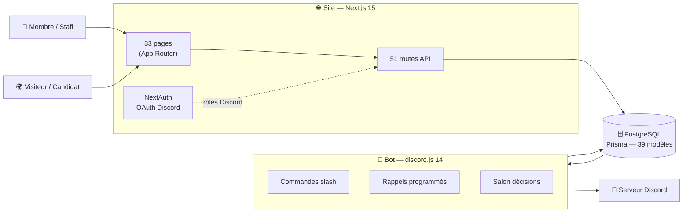
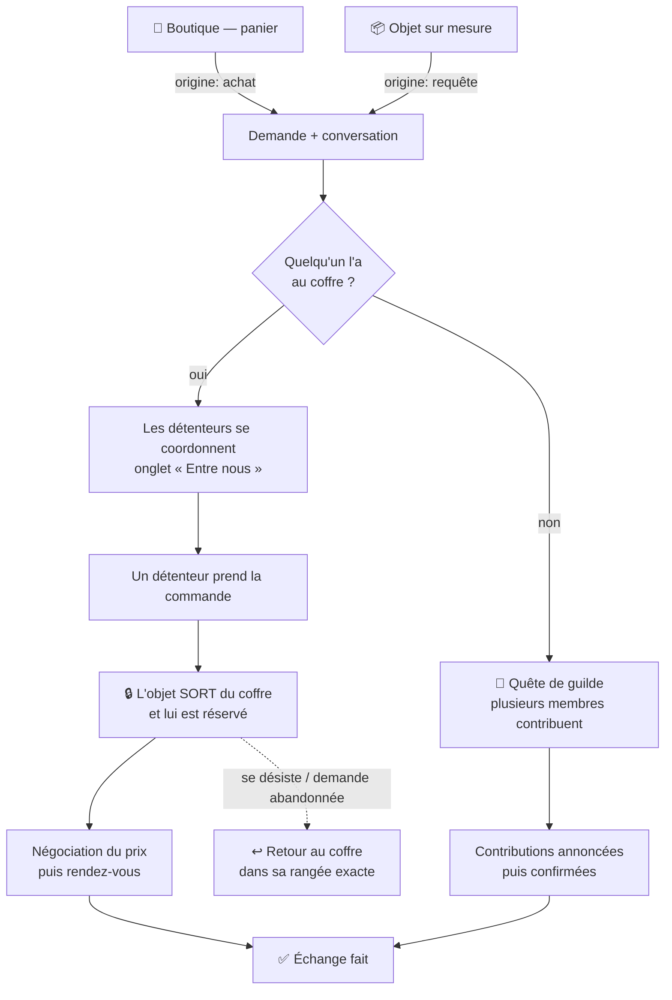
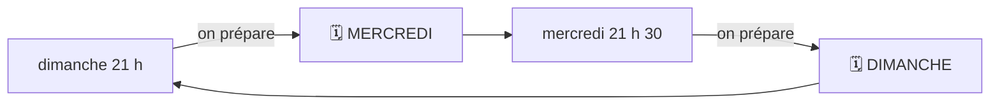
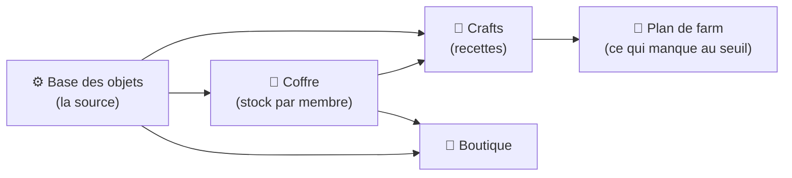
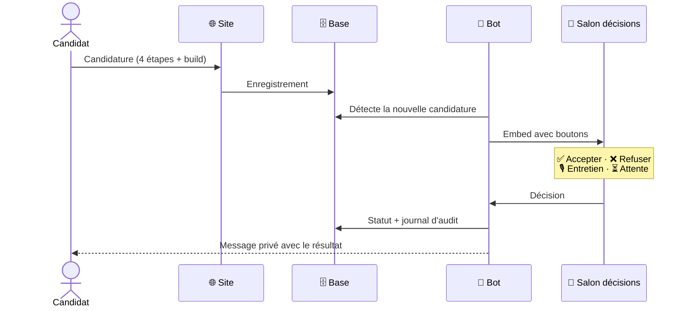
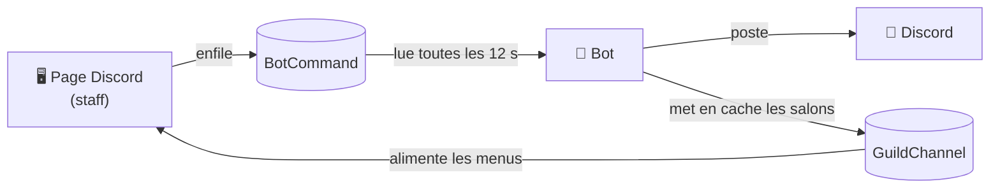
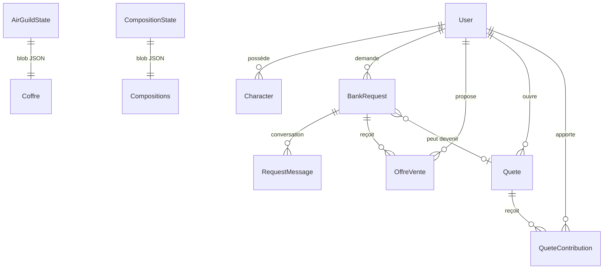

<div align="center">

# 🦉 Vanguard Control Center

**La plateforme tout-en-un de la guilde Vanguard** — serveur privé **AirFlyff**

Un site web et un bot Discord qui partagent la même base de données :
ce qui se passe sur le site se retrouve sur Discord, et inversement.

*Vanguard ne cherche pas le nombre mais la présence : **Discord et vocal obligatoires**.
Les outils de ce dépôt existent pour servir ça — préparer les Chambres Secrètes,
faire circuler les objets entre membres et suivre les progressions, sans paperasse.*


</div>

---

## 🧭 Vue d'ensemble


```mermaid
flowchart LR
    M["👤 Membre / Staff"] --> UI
    V["🌍 Visiteur / Candidat"] --> UI

    subgraph SITE["🌐 Site — Next.js 15"]
        UI["33 pages<br/>(App Router)"] --> API["51 routes API"]
        AUTH["NextAuth<br/>OAuth Discord"]
    end

    API --> DB[("🗄️ PostgreSQL<br/>Prisma — 39 modèles")]

    subgraph BOT["🤖 Bot — discord.js 14"]
        CMD["Commandes slash"]
        CRON["Rappels programmés"]
        DEC["Salon décisions"]
    end

    BOT --> DB
    DB --> BOT
    AUTH -.->|"rôles Discord"| API
    BOT --> DISCORD["💬 Serveur Discord"]
```

La base est le **point de rendez-vous** : le site écrit, le bot lit (et inversement).
Aucun des deux n'appelle l'autre en direct — c'est ce qui permet de redémarrer
l'un sans casser l'autre.

---

## 🗺️ Les cinq espaces

La navigation est rangée **par tâche**, pas par table. Chaque espace ouvre sur
ce qu'on vient y faire (`src/config/nav.ts`).

| Espace | Accès | Pages |
|---|---|---|
| ⚔️ **Jouer** | membre | Mes personnages · AirBuilder · Compositions · World Boss · Mes absences |
| 🧭 **Le jeu** | public | Donjons · Guide de progression · Prestige |
| 🎯 **Quête Guilde** | membre | Quêtes principales, secondaires, mes requêtes |
| 🪙 **Économie** | public → staff | Boutique · Mes demandes & messages · Coffre · Crafts · Base des objets · Plan de farm |
| 🛡️ **Guilde** | staff | Membres & builds · Candidatures · Statistiques · Journal · World Boss · Bot Discord · Annonce · Events |

Hors espaces : **Accueil** (histoire), **Candidature**, **Connexion**.

---

## 🔁 Le cycle d'une demande

C'est le cœur du site. Une demande **est** une conversation : son état, son prix
et la discussion vivent au même endroit (`/messages`).

Deux natures, deux façons d'y répondre — et l'écran le dit avant qu'on ouvre :


```mermaid
flowchart TD
    A["🛒 Boutique — panier"] -->|"origine: achat"| D
    B["📦 Objet sur mesure"] -->|"origine: requête"| D
    D["Demande + conversation"] --> E{"Quelqu'un l'a<br/>au coffre ?"}

    E -->|"oui"| F["Les détenteurs se coordonnent<br/>onglet « Entre nous »"]
    E -->|"non"| G["🎯 Quête de guilde<br/>plusieurs membres contribuent"]

    F --> H["Un détenteur prend la commande"]
    H --> I["🔒 L'objet SORT du coffre<br/>et lui est réservé"]
    I --> J["Négociation du prix<br/>puis rendez-vous"]
    J --> K["✅ Échange fait"]
    I -.->|"se désiste / demande abandonnée"| L["↩️ Retour au coffre<br/>dans sa rangée exacte"]

    G --> M["Contributions annoncées<br/>puis confirmées"]
    M --> K
```

**Pourquoi l'objet sort du coffre dès la prise** : c'est le détenteur qui conclut.
Tant que l'objet y restait, la boutique le montrait disponible et un second
acheteur pouvait se le faire promettre. Chaque mouvement laisse une ligne en
français dans la conversation.

Le prix suit le même principe : **le vendeur annonce son tarif en premier**, une
seule offre est active à la fois, un refus est explicite, et il y a un délai de
5 min entre deux propositions. Le paiement se fait en **périns**, en **Airpoints**
ou dans les deux — l'acheteur annonce ce qu'il peut sortir dès la demande.

---

## ⚔️ Les Chambres Secrètes

Une seule séance se prépare à la fois : **la prochaine**. Les fenêtres
s'enchaînent sans trou, et une annonce ne vaut que pour la fenêtre où elle a été
faite — tout se remet à zéro d'une séance à l'autre.


```mermaid
flowchart LR
    A["dimanche 21 h"] -->|"on prépare"| B["🗓️ MERCREDI"]
    B --> C["mercredi 21 h 30"]
    C -->|"on prépare"| D["🗓️ DIMANCHE"]
    D --> A
```

- **Composition** — 12 postes (dont 2 optionnels) répartis en tanks, DPS physique,
  DPS magique. Plusieurs candidats par poste ; le staff choisit le titulaire ★.
- **Présence** — une pop-up la demande à l'arrivée, une fois par séance. La
  composition est une **cible, pas un plafond** : on voit ce qui manque *et* qui
  est en plus, et le staff retient qui joue.
- **Stratégie** — un sous-onglet que le staff compose lui-même en blocs (titre,
  paragraphe, image importée ou liée).

---

## 🏦 Coffre, crafts et base des objets

Le stock réel vit dans l'**AirGuild** (`public/airguild/`), coffre par membre.
Trois onglets, trois rôles :


```mermaid
flowchart LR
    S["⚙️ Base des objets<br/>(la source)"] --> C["🔨 Crafts<br/>(recettes)"]
    S --> B["🏦 Coffre<br/>(stock par membre)"]
    B --> C
    C --> F["🌱 Plan de farm<br/>(ce qui manque au seuil)"]
    B --> BQ["🛒 Boutique"]
    S --> BQ
```

Un ingrédient de recette **désigne** un objet de la base par son identifiant : il
ne le décrit pas. Son nom, son icône et son unité se lisent sur la base et la
suivent. Un objet qui manque s'ajoute **à la base**, jamais dans la recette.

---

## 🎯 Quête Guilde

Ce qu'un membre demande dans « Mes requêtes » devient une **quête principale**
que toute la guilde voit et peut prendre à plusieurs. Chacun annonce ce qu'il
apporte (personne ne farme deux fois la même chose), le demandeur confirme à la
réception.

Une requête d'objet que personne n'a au coffre peut basculer en quête d'un clic —
et les deux restent reliées : **« Suivre dans les quêtes → »** depuis la
conversation, **« Requête objet → »** depuis la quête.

---

## 👤 La fiche d'un membre

Partout où un pseudo s'affiche, il se clique. La fiche dit depuis quand il est
là, son rang, ses personnages (cliquables → build en **lecture seule**), et
surtout son bilan :

| Ce qu'il a acheté | Ce qu'il a demandé | Ce qu'il a rendu |
|---|---|---|
| boutique, avec les statuts | requêtes objet + quêtes ouvertes | quêtes aidées, objets fournis |

Le volet marchand (ventes conclues, périns et Airpoints encaissés, engagements en
cours, achats à crédit) est **réservé au staff** — le serveur ne l'envoie même
pas aux autres.

---

## 🤖 Le bot

**14 commandes slash** et surtout des **automatismes** :

- **Salon décisions** : chaque candidature ou demande arrive en embed avec des
  boutons — le staff décide **en 1 clic**, le membre est prévenu **en message
  privé**, tout est journalisé.
- **Rappels** : Chambres Secrètes de la veille avec l'effectif manquant,
  candidatures en attente, événements du jeu (configurés depuis le site, sans
  redémarrage).
- **Salon des ventes** : chaque demande d'objet est annoncée aux détenteurs, et
  l'annonce se met à jour quand quelqu'un la prend.
- **Rôles en self-service** : panneau de classes à boutons, bouton-rôles,
  rôle-réactions. **Giveaways** avec tirage et clôture automatiques.


```mermaid
sequenceDiagram
    actor C as Candidat
    participant S as 🌐 Site
    participant B as 🗄️ Base
    participant T as 🤖 Bot
    participant D as 💬 Salon décisions

    C->>S: Candidature (4 étapes + build)
    S->>B: Enregistrement
    T->>B: Détecte la nouvelle candidature
    T->>D: Embed avec boutons
    Note over D: ✅ Accepter · ❌ Refuser<br/>🎙️ Entretien · ⏳ Attente
    D->>T: Décision
    T->>B: Statut + journal d'audit
    T-->>C: Message privé avec le résultat
```

Le site peut aussi **commander le bot** via une file en base :


```mermaid
flowchart LR
    A["🖥️ Page Discord<br/>(staff)"] -->|"enfile"| Q[("BotCommand")]
    Q -->|"lue toutes les 12 s"| B["🤖 Bot"]
    B -->|"poste"| D["💬 Discord"]
    B -->|"met en cache les salons"| G[("GuildChannel")]
    G -->|"alimente les menus"| A
```

👉 Détails complets dans [`bot/README.md`](bot/README.md).

---

## 🔐 Accès par rôle

| Niveau | Rôles Discord | Ce qu'il ouvre |
|---|---|---|
| **Public** | tout le monde | Accueil, Le jeu, Boutique (parcourir), candidature |
| **Vérifié** | membre du serveur Discord | Builder, partage de build |
| **Membre** | 👑 Vanguard · 🧭 Général · 🔥 Officier · 📋 Vétéran · ⚔️ Guard | Jouer, Quête Guilde, demandes |
| **Staff** | 👑 Vanguard · 🧭 Général · 🔥 Officier | Coffre, Guilde, décisions |

Le gating est fait **côté serveur** (middleware → layouts → API). Masquer un
bouton ne suffit jamais : l'API revérifie.

---

## 🗄️ Le modèle, en gros


```mermaid
erDiagram
    User ||--o{ Character : "possède"
    User ||--o{ BankRequest : "demande"
    User ||--o{ OffreVente : "propose"
    User ||--o{ Quete : "ouvre"
    User ||--o{ QueteContribution : "apporte"
    BankRequest ||--o{ RequestMessage : "conversation"
    BankRequest ||--o{ OffreVente : "reçoit"
    BankRequest }o--o| Quete : "peut devenir"
    Quete ||--o{ QueteContribution : "reçoit"
    AirGuildState ||--|| Coffre : "blob JSON"
    CompositionState ||--|| Compositions : "blob JSON"
```

Deux états vivent en **blob JSON** partagé plutôt qu'en tables : le coffre
(`AirGuildState`) et les compositions (`CompositionState`). C'est ce qui permet
aux applications embarquées de les manipuler telles quelles — au prix d'une
règle stricte : on ne PUT jamais un état partiel, l'écriture remplace tout.

---

## 🛠️ Stack

**Next.js 15** (App Router) · **React 18** · **TypeScript 5** · **PostgreSQL 16** +
**Prisma 5** · **NextAuth** (OAuth Discord) · **discord.js 14** + **node-cron** ·
**Docker** (prod)

**Design** — thème sombre, charte orange/noir. Polices auto-hébergées **Rubik**
(titres) · **Athiti** (corps) · **Alef** (accents).

Les deux gros éditeurs (**AirBuilder** et **AirGuild**) sont des applications
JavaScript embarquées dans `public/`, branchées à la base via les routes API.

---

## 🎨 Conventions à connaître

### Icônes : une seule source, deux mondes

Les icônes sont générées depuis `src/lib/vg-icon-paths.ts` :

```bash
npm run icons     # → public/icons/vg-icons.css + .js
```

- **React** : `<Icon name="sword" size={16} />`
- **Apps embarquées** : `<i class=vgi-sword></i>`

Jamais d'emoji comme icône d'interface, et jamais de SVG copié à la main dans un
composant : la source est unique.

### Migrations

**Jamais `prisma migrate`** sur ce projet : `npx prisma db push` puis
`npx prisma generate`. Après un `db push`, **redémarre le serveur de dev** —
sinon le client Prisma en mémoire ignore les nouveaux champs et répond 500.

### Écrire dans un état partagé

`AirGuildState` et `CompositionState` sont remplacés **en bloc**. Lire d'abord,
écrire ensuite, et ne jamais envoyer un état qu'on n'a pas fini de charger : une
composition entière s'est déjà perdue comme ça (protections en place depuis).

---

## 🚀 Installation locale

```bash
# 1) Dépendances
npm install

# 2) Variables d'environnement
cp .env.example .env        # puis remplis les valeurs

# 3) Base de données (PostgreSQL via Docker, port hôte 5434)
docker compose up -d
npm run db:push
npm run db:seed             # (optionnel) données du coffre

# 4) Le site
npm run dev                 # → http://localhost:3000

# 5) (optionnel) Le bot, dans un autre terminal
npm run bot:deploy          # enregistre les commandes slash (une fois)
npm run bot
```

> 💡 **Mode dev** : `DEV_ALL_ACCESS=1` + `NEXT_PUBLIC_DEV_ALL_ACCESS=1` simulent un
> compte Direction sans connexion Discord. **Jamais en production.**

---

## 🔑 Variables d'environnement

| Groupe | Variables | Rôle |
|---|---|---|
| Base | `DATABASE_URL` | Connexion PostgreSQL (partagée site + bot) |
| Site | `NEXTAUTH_URL` · `NEXTAUTH_SECRET` | URL publique + secret de session |
| OAuth | `DISCORD_CLIENT_ID` · `DISCORD_CLIENT_SECRET` | Application Discord |
| Bot | `DISCORD_BOT_TOKEN` · `DISCORD_GUILD_ID` | Token + id du serveur |
| Salons | `CHANNEL_DECISION` · `CHANNEL_CANDIDATURES` · `CHANNEL_STAFF` · `CHANNEL_EVENTS` · `CHANNEL_VENTES` · `CHANNEL_EXCHANGE_CATEGORY` | Où le bot poste |
| Rôles | `ROLE_DIRECTION` … `ROLE_GUARD` · `ROLE_CLASSE_*` | Ids des rangs et des 8 classes |
| Dev | `DEV_ALL_ACCESS` · `NEXT_PUBLIC_DEV_ALL_ACCESS` | Bypass local uniquement |

Le détail commenté est dans **`.env.example`** et **`.env.prod.example`**.

---

## 🗂️ Structure

```
src/app/
  (public)/   histoire · candidature · donjons · astuces · prestige
  (auth)/     login
  (verified)/ builder (+ /builder/<membre> lecture seule) · build/<lien>
  (guild)/    personnages · compositions (+ build de référence par poste)
              quetes · worldboss · absences · dashboard
  (shop)/     boutique · messages · demandes · dettes · sommaire
  (admin)/    guildviewer · coffre (AirGuild) · plan-farm · candidatures
              statistiques · journal · gestion-worldboss · discord
              annonce · events
  api/        51 routes (auth, characters, builder-state, compositions,
              coffre, ventes, bank-request, messages, membres, quetes…)

src/lib/      ventes · messagerie · compositions · strategie · quetes
              specsFlyff · monnaies · coffre · xp · discord…
bot/          commandes, planificateur, salon décisions → bot/README.md
prisma/       schéma (39 modèles) + seed du coffre
public/       moteurs AirBuilder & AirGuild (données + icônes)
```

Pour l'authentification, les niveaux d'accès et le modèle de données :
**[`ARCHITECTURE.md`](ARCHITECTURE.md)**.

---

## 🌐 Déploiement

La prod tourne en **Docker** sur un VPS : conteneurs `db` (PostgreSQL), `web`,
`bot`, avec application du schéma au démarrage, derrière **Nginx Proxy Manager**.

```bash
cd ~/vanguardmmo && git pull && docker compose -f docker-compose.prod.yml up -d --build
```

Le guide pas-à-pas (VPS, SSL, redirect OAuth, sauvegardes) : **[`DEPLOY.md`](DEPLOY.md)**.

---

## ⚠️ Sécurité

- **`.env` n'est jamais versionné** — seuls `.env.example` / `.env.prod.example` le sont.
- **Régénérer** `DISCORD_CLIENT_SECRET`, `DISCORD_BOT_TOKEN` et `NEXTAUTH_SECRET`
  s'ils ont circulé en clair.
- Tous les contrôles d'accès sont **serveur**, y compris les quantités du coffre
  et les messages privés entre détenteurs : ce qui ne doit pas être vu n'est pas
  envoyé, pas seulement caché.

---

<div align="center">

*Site + bot par **syko**, pour la guilde Vanguard (AirFlyff).*

</div>
